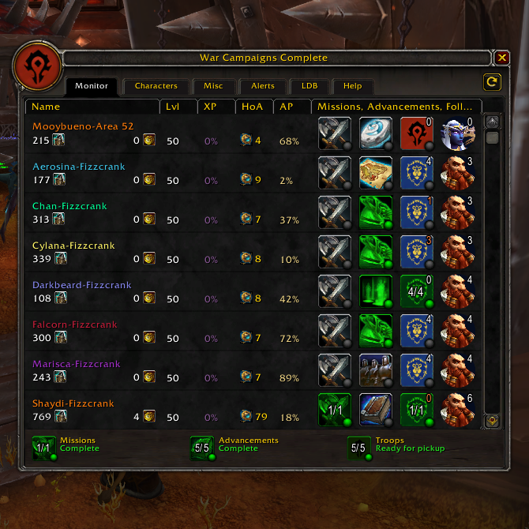

# War Campaigns Complete

<a href="https://www.paypal.com/cgi-bin/webscr?hosted_button_id=37B3BPALKHXAS&amp;item_name=War+Campaigns+Complete+(from+GitHub)&amp;cmd=_s-xclick"><strong style="text-decoration: underline;">Donate</strong> using <strong>PayPal</strong> if you ❤ this addon!</a>

Monitors Missions, Advancements, and Followers account-wide.

*Supports Battle for Azeroth War Campaigns (Garrisons 8.0).*

## Features
* Tracks data across all your characters, main and alts, account-wide.
* Choose what to monitor for each character.
* Tracks <strong>Missions</strong> in progress.
* Tracks&nbsp;<strong>Heart of Azeroth Level </strong>(tooltip shows Artifact Power to next level).
* Tracks<strong> Artifact Power (AP)</strong>&nbsp;percent to next level.
* Tracks&nbsp;<strong>Level and XP</strong> percent to next level.
* Tracks&nbsp;<strong>War Resources</strong>.
* Shows <strong>new tier Advancement</strong>&nbsp;choices available.
* Shows all previously&nbsp;<strong>selected Advancement tiers</strong>.
* Tracks&nbsp;<strong>Seal of Wartorn Fate</strong> (tooltip shows completion of "Seal of Wartorn Fate" quests).
* Tracks&nbsp;<strong>Troops</strong>&nbsp;(orders and durability) and <strong>Champions</strong> (XP to next quality).
* Limited <strong>LibDataBroker</strong> support and options.
* Slash command <strong>/wcc</strong> or <strong>/warcampaignscomplete</strong> will also open and close.

## Options
* Order Automatically (Characters)
* Current Character First
* Show Minimap button
* Show Character Tooltip (Minimap button)
* Dock Minimap Button (uncheck to drag anywhere on screen)
* Lock Minimap Button
* Large Minimap button (intended to be used as a replacement for the Missions Report button)
* Show Original Missions Report Minimap button (uncheck to hide the default UI Missions Report button)
* Show Troop Details In Tooltip
* Show Character Realms
* Forget Drag Position (w/Center button)
* Monitor Rows (8-12)
* Monitor Columns (Change/Reset)
* Alert [Current Character, Any Character, Disabled] (Flashes Minimap button when an indicator is green, meaning Complete)
* Alert: Enable or disable for Missions, Advancements, and Troop Work Orders.
* Alert: Disable in Instances
* LDB: Source [Current Character, All Characters]
* LDB: Text Format (includes Labels, (Next: 1 Hr), Character Name)
* LibDBIcon: Hide LibDBIcon Minimap Button
* LibDBIcon: Show Character Tooltip

## Getting Started
* Log into a character you want to monitor.
* Select Characters tab and uncheck what you don't want to monitor.
* Repeat 1-2 for all characters you want included in this addon.

## Bugs &amp; Suggestions

Please make sure you have the latest version and post into the CurseForge.com comments with details and if possible a screenshot. Thank you for taking the time to report an issue, it helps make the addon better for everyone.

## Known Issues
* Actions taken on the WoW Companion App cannot be recorded by the addon. If you make frequent use of the app then using this addon is not advised.
* Does not account for changes in client computer time. For example, logging in with the addon enabled in a new timezone or after daylight savings time changes will cause small temporary discrepancies.

## Addons by cmc3215

* <a href="https://github.com/cmc3215/collectionshop">CollectionShop</a>
* <a href="https://github.com/cmc3215/professions-complete">Professions Complete</a>
* <a href="https://github.com/cmc3215/battle-net-friend-alert">Battle.net Friend Alert</a>
* <a href="https://github.com/cmc3215/hide-clean-up-bags-button">Hide Clean Up Bags Button</a>
* <a href="https://github.com/cmc3215/class-order-halls-complete">Class Order Halls Complete</a>
* <a href="https://github.com/cmc3215/war-campaigns-complete">War Campaigns Complete</a>
* <a href="https://github.com/cmc3215/work-orders-complete">Work Orders Complete</a>
